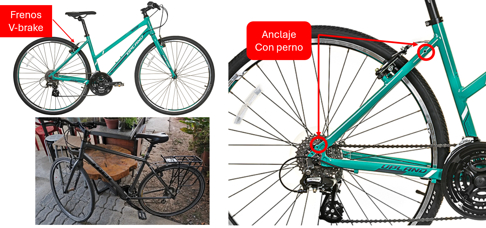
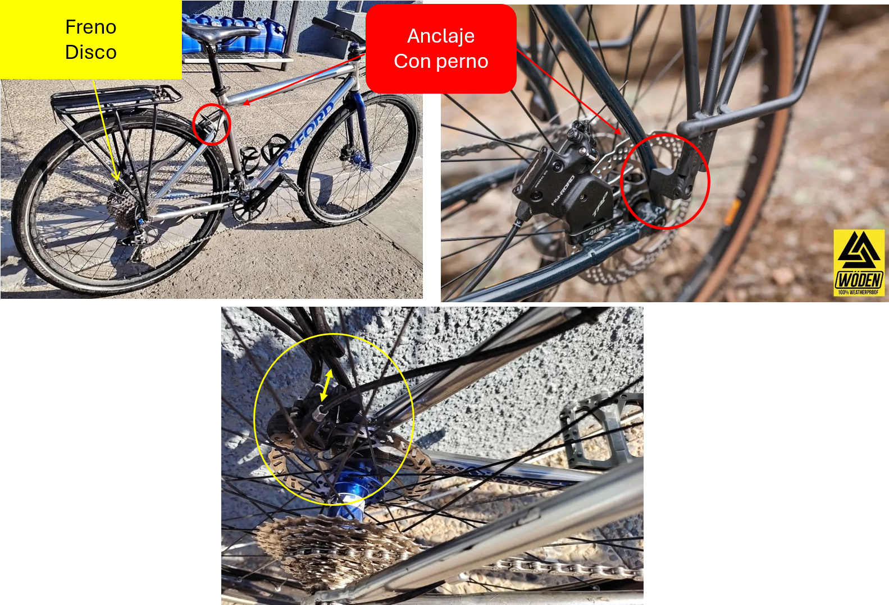
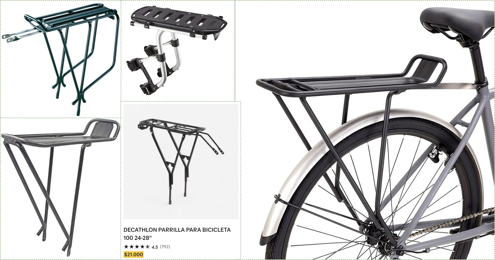
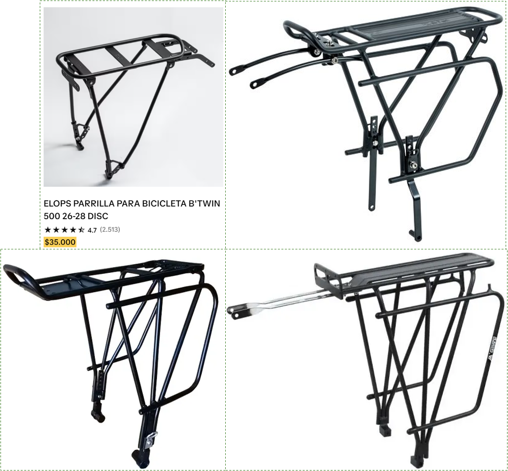
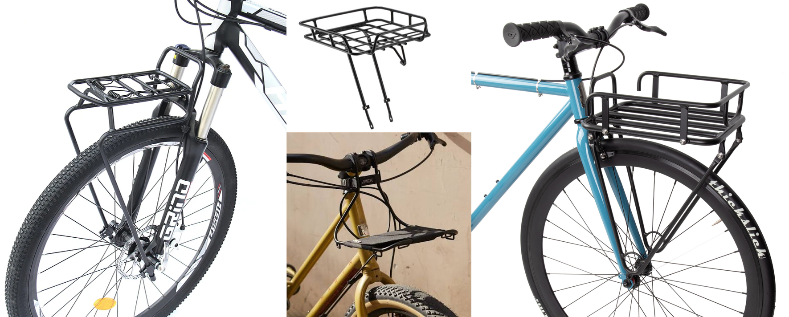
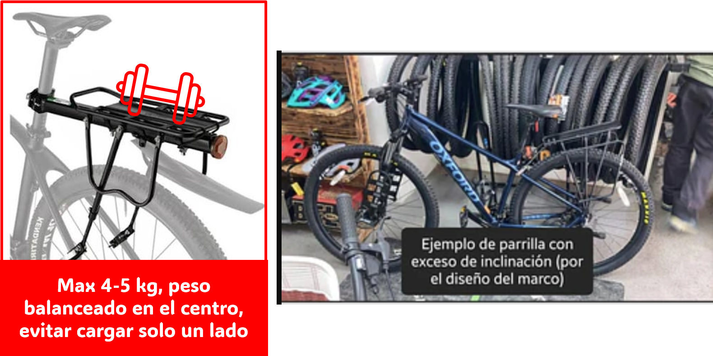
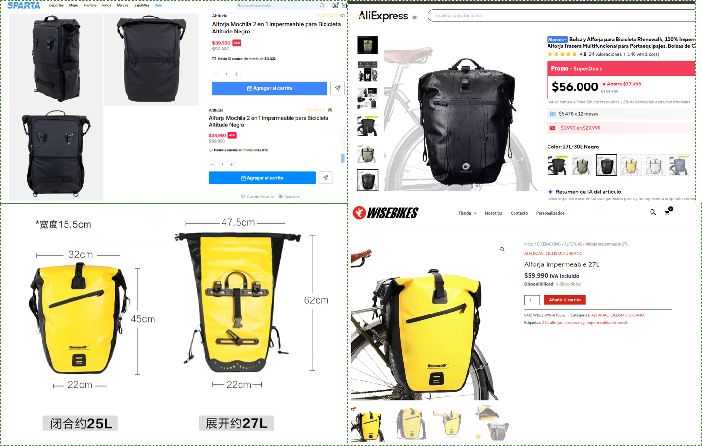
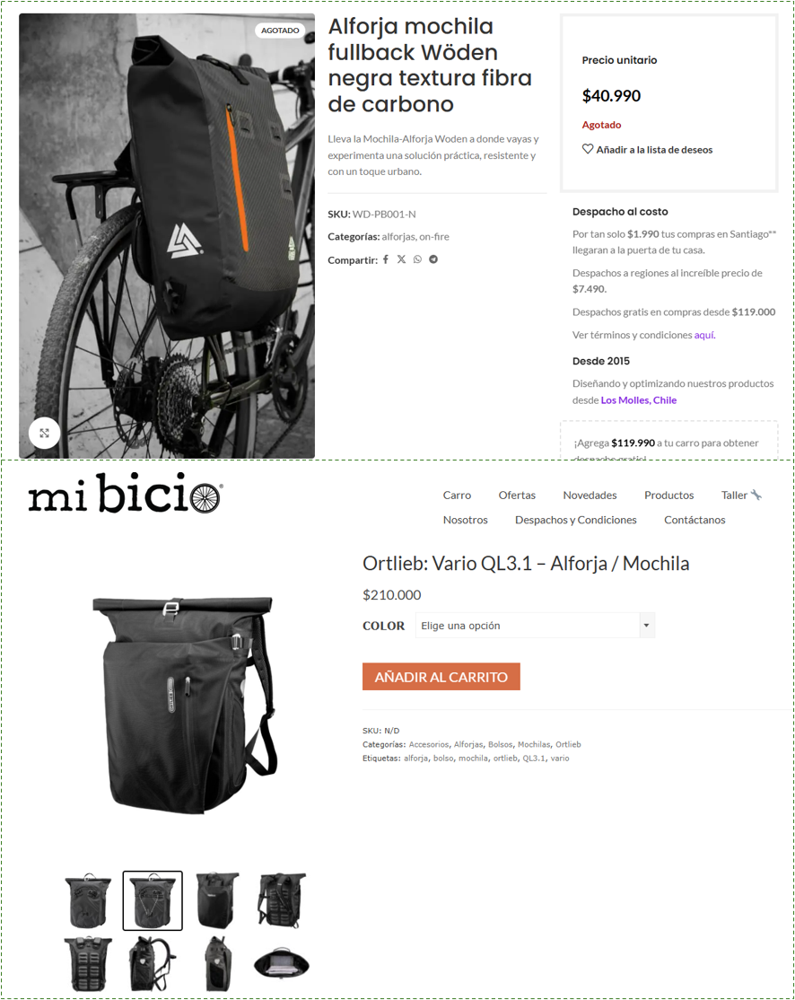
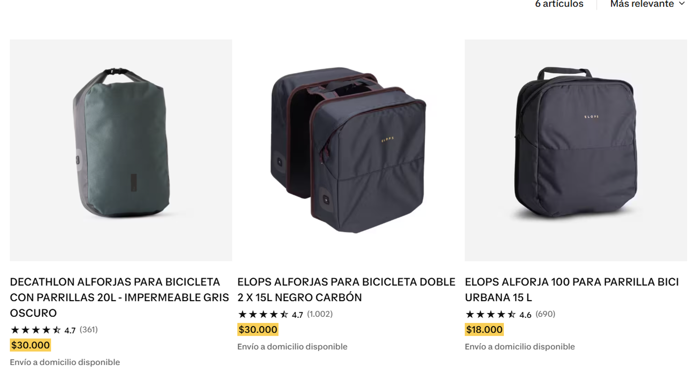

Bienvenidos al **Newsletter de Edi**, un newsletter semanal donde envío tips, ideas, anécdotas y demás, sobre ciclismo urbano y deportivo.

---

**Resumen de hoy**
* La Anécdota y el Error Térmico
* El Problema Sistémico (El Radiador Bloqueado)
* 5 Consideraciones Claves para Transferir la Carga
* El Cierre y Debate

---

## **La Anécdota y el Error Térmico**

Hace años, llegaba a la oficina sintiendo que había corrido una maratón. La espalda empapada, la camisa pegada al cuerpo y una sensación de agotamiento que no correspondía a un pedaleo plano de cinco kilómetros[cite: 12].

Creía, erróneamente, que era falta de estado físico o un exceso de abrigo matutino[cite: 12].

Un día, al quitarme la mochila de cinco kilos que llevaba cargada, entendí el error. No era un problema de resistencia muscular. Estaba saboteando mi propio sistema de refrigeración. Moverse por la ciudad con peso en el cuerpo es una falla logística básica que la mayoría de los ciclistas urbanos comete[cite: 12].

## **El Problema Sistémico (El Radiador Bloqueado)**

Desde la termodinámica, el cuerpo humano es un motor de combustión que necesita disipar calor constantemente. En este sistema, tu espalda funciona como el radiador principal[cite: 12].

Si te cuelgas una mochila pegada a la columna, anulas por completo la ventilación. El flujo de aire se corta. El sudor, que es el mecanismo natural de enfriamiento, no puede evaporarse y se acumula atrapado entre la tela y tu piel[cite: 12].

La solución técnica no es pedalear más lento ni usar desodorantes más caros. La solución es transferir la carga. La bicicleta, como máquina, está diseñada para soportar el peso; tu columna vertebral no. Liberar tu espalda es el paso definitivo para transformarte de un ciclista sudado a un profesional que llega impecable a su reunión[cite: 12].

## **5 Consideraciones Claves para Transferir la Carga**

Para ejecutar esta transferencia necesitas dos elementos: una parrilla (el chasis) y una alforja (el contenedor). El mercado está lleno de opciones, pero si no conoces la mecánica de tu máquina, botarás tu dinero. Este es el manual de compra[cite: 12].

### **1. El tipo de freno dicta tu chasis (V-Brake vs. Disco)**

No todas las parrillas sirven para todas las bicicletas. Tu primer paso es mirar tu rueda trasera. Si tienes frenos tradicionales de pastilla (V-Brake), necesitas una parrilla estándar. Estas bajan rectas y se anclan al marco utilizando pernos Allen de cinco milímetros en los tirantes y cerca del eje[cite: 12].

Si tu bicicleta tiene frenos de disco, la geometría cambia. El caliper (mordaza) del freno ocupa espacio físico. Necesitas comprar una parrilla específica para frenos de disco, las cuales son más anchas en su base para esquivar el mecanismo de frenado sin rozarlo[cite: 12].

### **2. La arquitectura del fierro (El soporte en L)**

Al evaluar modelos de aluminio o acero, fíjate en las barras laterales. Las parrillas de mejor diseño incluyen un tercer fierro o una estructura en forma de "L" invertida hacia abajo. Esta pieza no es estética; es una barrera física diseñada para evitar que tu bolso o alforja se balancee y termine enredándose en los rayos de la rueda en movimiento[cite: 12].

Las opciones de parrillas para bicicletas con frenos V-Brake:

Las opciones de parrillas para bicicleta con freno de disco:

### **3. El peso en la dirección (La opción frontal)**

Existen parrillas y canastos delanteros. Son muy útiles para llevar la carga a la vista, pero alteran drásticamente la conducción. Poner peso sobre el eje delantero modifica la inercia de la dirección, haciéndola más torpe. Úsalas estrictamente para bultos pequeños, como carteras o cajas que no superen los cuatro kilos[cite: 12].

### **4. Las trampas estructurales (Lo que debes evitar)**

El mercado online ofrece parrillas flotantes que se anclan exclusivamente al tubo del asiento. Como ingeniero, no las recomiendo para el uso diario. Son estructuras endebles que generan un efecto palanca severo, se mueven lateralmente y no deben cargar más de cinco kilos con un peso perfectamente balanceado. Del mismo modo, huye de las parrillas que, por un mal diseño del marco, quedan con un ángulo de inclinación hacia atrás. La carga siempre debe ir paralela al suelo[cite: 12].

### **5. El contenedor híbrido (La alforja moderna)**

La industria evolucionó. Ya no necesitas bolsos de cicloturismo gigantes. Marcas nacionales e internacionales ofrecen mochilas híbridas que incluyen ganchos ocultos para anclarse a la parrilla de la bicicleta, y luego se transforman en mochilas formales para entrar a la oficina. No te dejes engañar por el volumen; un bolso impermeable de quince a veinte litros es espacio más que suficiente para un computador, el almuerzo y ropa de cambio. Si compras un contenedor más grande, el vacío te tentará a llenarlo de cosas inútiles[cite: 12].

## **El Cierre y Debate**

Moverse en la ciudad no debe ser un esfuerzo de carga. Tu vehículo es la herramienta logística, tú eres solo el motor y el piloto[cite: 12].

Sacarte el peso de encima es la diferencia entre sufrir el viaje o dominar el trayecto[cite: 12].

Revisa tu bicicleta hoy. ¿Sigues castigando tu espalda con una mochila de oficinista o ya hiciste la transición definitiva a la parrilla y las alforjas? Te leo en los comentarios[cite: 12].